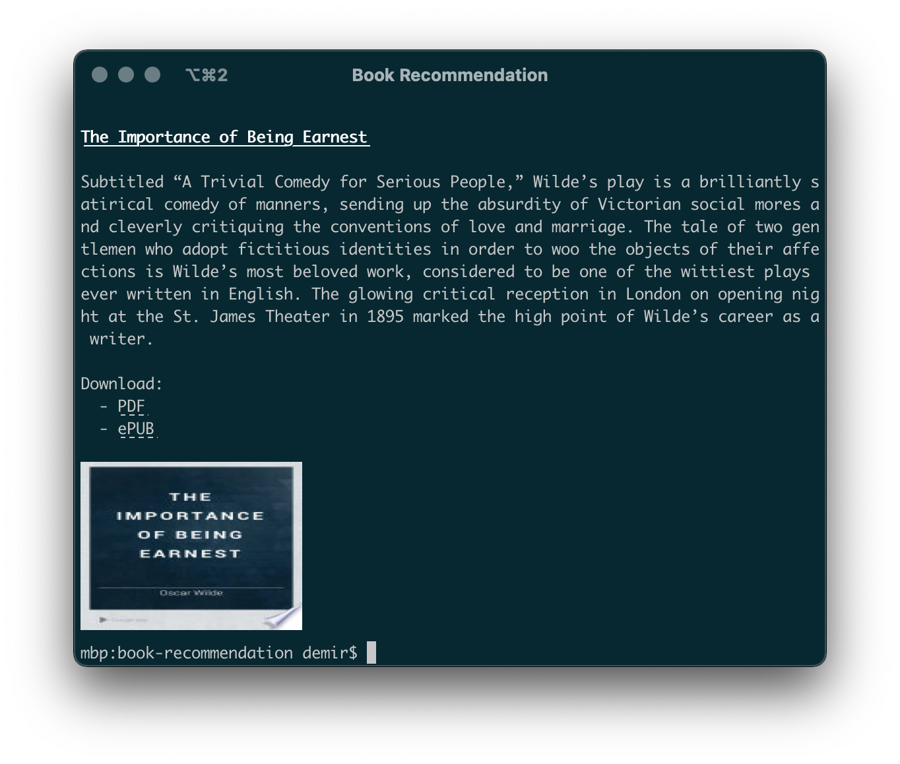

# Confused Librarian

Get random book recommendations from the comfort of your terminal. If you like a book's description, a full eBook download is just a click away.

<sup>_Confused Librarian picks a random word, then displays the description of a random book that contains that word._</sup>



## Installation and Use

<a name="installation"></a>

**Prerequisites:**

- A free Google Books API key. Refer to the following documentation to obtain a key: https://developers.google.com/books/docs/v1/using#APIKey. This process takes less than 5 minutes with an existing Google account.
- [Node.js](https://nodejs.org) (v14 or above), [Yarn 2](https://yarnpkg.com/getting-started), and a terminal emulator such as [iTerm2](https://iterm2.com). Not all terminal emulators support displaying images and clickable links.
- _Optional:_ An API key for [WordsAPI](https://rapidapi.com/dpventures/api/wordsapi). This API enables searching for books using a word bank of 300,000 words instead of 10,000. After obtaining an API key, use WordsAPI by running the script with the `--expanded` flag.

---

After fulfilling the prerequisites, clone this repository, then open the `.env` file at the project root and replace the text `YOUR_API_KEY` with the corresponding API key(s).

Now you're ready to run the script. Thanks to [zero-installs](https://yarnpkg.com/features/zero-installs), there's no need for an installation step.

```shell
# get a random book recommendation
yarn start

# expand the list of potential books by using a larger word bank from WordsAPI
yarn start --expanded

# don't require a recommended book to include a description and download link
yarn start --lowdetail

# find a random book that contains a query that you specify
# includes --lowdetail by default in order to provide results for queries that have no downloadable books
yarn start --query "my query"

# learn about other options
yarn start --help
```

If you plan to contribute to the repository, you may find it helpful to read about [Yarn 2's editor SDKs](https://yarnpkg.com/getting-started/editor-sdks).

## Motivation

I made this for fun to practice using Node.js and a few of its commonly used dependencies.
